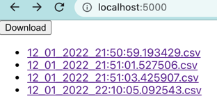

# start_wars_api

starwars service


## Getting started

To Run app in start_wars_api folder

```
docker-compose up
```

To Run tests in start_wars_api folder

```
docker-compose run --rm backend ./docker/run-tests.sh
```

To create admin user run:

```
docker-compose run --rm backend python manage.py createsuperuser
```

## UI Documentation

- localhost:5000 -> Homepage, detail page after link click
- after download reload page to see updated list
- localhost:5000/backend/admin -> Admin panel



- localhost:5000/:id -> Detailpage


## API Documentation:

- localhost:5000/swagger


## Improvements

- Add more test only most basic cases implemented  
- Add service to interact with CSV files,
  currently this responsibility is splitted between few classes
  
- Add cache for caching responses from SWAPI
    
